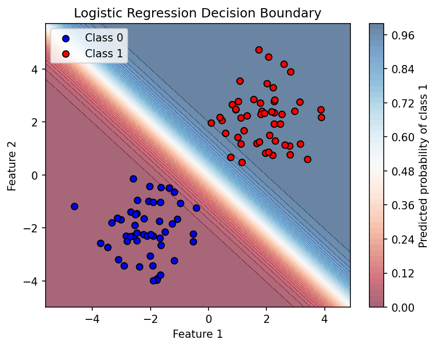

# Logistic Regression from Scratch

## What is it?
A machine learning algorithm used to predict the probability of a 
binary outcome. It learns weights for each feature using gradient 
descent to minimize cross-entropy loss. To predict on new data, it 
computes a linear combination of weights and input, then passes it 
through a sigmoid function to get a probability.

## How to run
```
pip install numpy matplotlib
python demo.py
```

## Results


## What I learned
- **Why sigmoid?**
  Linear regression outputs any number — sigmoid squishes it to 
  between 0 and 1, giving a meaningful probability.

- **Why cross-entropy over MSE?**
  Cross-entropy punishes confident wrong answers much more harshly 
  than less confident ones. MSE doesn't have this property, making 
  it a poor fit for classification.

- **Why the gradient simplifies cleanly:**
  Despite starting with a complex log expression, the chain rule 
  causes the sigmoid derivative and cross-entropy derivative to 
  cancel each other out, leaving just (y_pred - y) * X. 
  Cross-entropy and sigmoid are paired specifically because of this.

## References
- Andrej Karpathy - Neural Networks: Zero to Hero
- Andrew Ng - Machine Learning Course